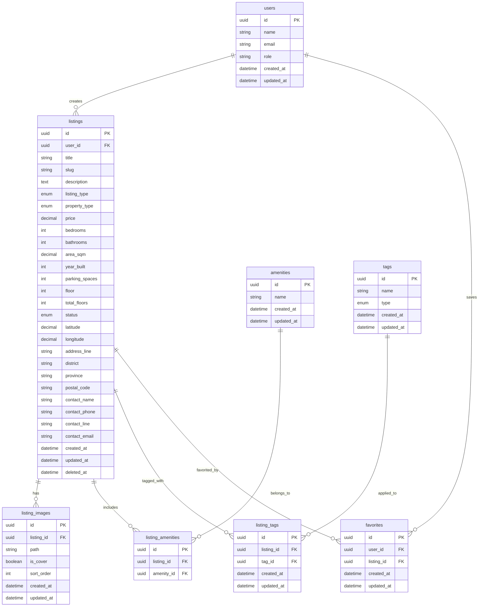

# Real Estate Platform

A modern property listing platform for buying, selling, and renting real estate properties.

## Entity Relationship Diagram

## Enums

### ListingType
- `sale`
- `rent`

### PropertyType
- `house`
- `condo`
- `townhome`
- `land`

### ListingStatus
- `draft`
- `published`
- `archived`

### TagType
- `general`
- `location`
- `feature`
- `condition`

### UserRole
- `admin`
- `user`
- `vendor`